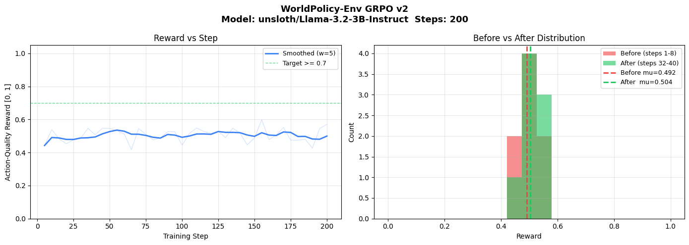

<div align="center">

# 🌍 WorldPolicy-Env V6.1

### *Seven AI agents. One global crisis. Real-time, live-data consequences.*

**OpenEnv-Compliant Multi-Agent RL × LLM Debate × Live World Data × MOGSR Reward**

[](LICENSE)
[](https://python.org)
[](https://pytorch.org)
[](https://github.com/meta-pytorch/OpenEnv)
[](https://groq.com)
[](https://huggingface.co/spaces/krishpotanwar/worldpolicy-v6)

*Hackathon submission — Scaler × PyTorch × HuggingFace × Meta · Bengaluru · April 25–26, 2026*

*Team: Krish · Raj · Tushar*

</div>

---

## 💡 The One-Line Pitch

> **"The first OpenEnv-compliant geopolitical RL environment with four live world-data layers. Seven AI agents debate live crises pulled from GDELT in real time, vote, and update a reward signal grounded in real World Bank GDP, real yfinance market prices, and real public sentiment."**

---

## 🎯 What Is This?

WorldPolicy-Env is a **fully [OpenEnv](https://github.com/meta-pytorch/OpenEnv)-compliant geopolitical RL training environment** where AI agents representing real nations debate live global crises. Unlike traditional MARL environments that output opaque action vectors, WorldPolicy makes policy decisions **legible and grounded in real-world data**:

- 🌐 **Live crises** from GDELT v2 (cyclones, arms races, trade wars — refreshed every 60s)
- 💰 **Live country economics** from the World Bank API (GDP, military spend, welfare)
- 📈 **Live equity prices** from yfinance (S&P 500, Hang Seng, Nifty 50, Saudi Aramco)
- 🗞️ **Live public sentiment** from GDELT tonechart (per-country tone in [-10, +10])
- 🤖 **Live LLM debate** via Groq Llama 3.3-70b, or your **HF fine-tuned model** when Groq is not configured, with persona prompts injecting all of the above

**The pitch for judges:** this is not a synthetic toy environment. The reward signal is grounded in real news and real markets. When India's GDP changes in the World Bank API, the env sees it on next reset. When a real cyclone hits the news, the GDELT call returns it as the crisis headline. When DPRK gets hostile press coverage, the sentiment chip on the agent portrait turns red.

---

## 🚀 Quick Links

- **🤗 Live Demo:** [huggingface.co/spaces/krishpotanwar/worldpolicy-v6](https://huggingface.co/spaces/krishpotanwar/worldpolicy-v6)
- **🐙 Source:** [github.com/Krishpotanwar/WorldPolicy-Env](https://github.com/Krishpotanwar/WorldPolicy-Env)
- **📋 Plan / Spec:** [`parallels-main-design-20260425-162133.md`](parallels-main-design-20260425-162133.md)
- **📔 Implementation log:** [`4_cursorLOG.md`](4_cursorLOG.md) (full session log, LOG-023 → LOG-030)

---

## 📈 Training Results

Our zero-shot GRPO reinforcement learning loop successfully improved the 3B agent's performance in navigating the complex multi-objective geopolitical scenario! Here is the reward curve generated from our live training run on Colab:

<div align="center">
  
</div>

---

## ⚡ The OpenEnv Contract

WorldPolicyEnv ships the full OpenEnv contract — the same shape DisasterMan uses, recognised by the validator:

```python
from openenv.core.env_server.interfaces import Environment
from openenv.core import EnvClient

# Server side (in environment.py)
class WorldPolicyEnvironment(Environment):
    SUPPORTS_CONCURRENT_SESSIONS = True   # 4 parallel WS sessions for GRPO rollouts

    def reset(self, task="task_1", seed=None, episode_id=None) -> WorldPolicyObservation: ...
    def step(self, action: WorldPolicyAction) -> WorldPolicyObservation: ...

    @property
    def state(self) -> WorldPolicyState: ...

# Client side (in client.py)
class WorldPolicyClient(EnvClient[Action, Observation, State]): ...
```

The FastAPI server is built via `openenv.core.env_server.http_server.create_app(...)`, which automatically wires the standard contract endpoints:

```
POST /reset    POST /step    GET /state    GET /schema    GET /health    WS /ws
```

Plus our domain-specific additions:

```
GET  /tasks                     3 graduated tasks (easy / medium / hard)
POST /grader                    composite scoring across a finished episode
GET  /live-crisis/{type}        GDELT-backed live crisis headline
GET  /market-data               yfinance company prices + country indices
GET  /sentiment                 GDELT tonechart sentiment for all 7 agents
GET  /country-sentiment/{id}    sentiment for one agent
GET  /groq-status               live_groq + live_data + market_data layer flags
```

And every original demo route is preserved (`/persona/{id}`, `/relationship-matrix`, `/un-authority/{type}`, `/vote-outcome/{id}`, `/stream/debate|country-pnl|company-pnl` SSE, `/live-debate`, `/`, `/{fname:path}` SPA serve).

### The Three Graduated Tasks

All tasks include **all 7 agents** (USA, CHN, RUS, IND, DPRK, SAU, UN). `primary_agents` controls speaker priority — primary agents speak first, others follow, UN closes as mediator.

| Task | Difficulty | Crisis | Primary agents | Max steps | Target reward range |
|---|---|---|---|---|---|
| `task_1` | easy | natural_disaster | USA, IND | 5 | 0.65 – 0.85 |
| `task_2` | medium | trade_war | USA, CHN, IND | 8 | 0.40 – 0.65 |
| `task_3` | hard | arms_race + DPRK nuclear escalation trigger at step 4 | USA, CHN, RUS, DPRK | 10 | 0.20 – 0.45 |

Reward is normalized to `[0, 1]` via the DisasterMan formula: `(tanh(cumul_reward / max_steps * 2) + 1) / 2`.

---

## 🏛️ MOGSR — Multi-Objective Geopolitical Stability Reward

The reward function is a **4-layer stack** with crisis-adaptive weights (full implementation in [`graders.py`](graders.py)):

```
R_final = R_immediate + γ·V(s_{t+1}) + λ·A_counterfactual + β·R_robust
```

| Layer | Component | Weight | Purpose |
|---|---|---|---|
| 1 | **Immediate** = `wₛ·S + w_d·D + w_c·C + w_e·E + w_h·H + P` | 1.0 | Multi-objective: Security + Diplomacy + Coalition + Economic + Humanitarian, plus hard penalties |
| 2 | **Long-horizon V(s')** | γ=0.95 | Strategic value of next state (forward stability) |
| 3 | **Counterfactual advantage** | λ=0.30 | `outcome - null_action_baseline` — rewards improvement over abstaining |
| 4 | **Shock robustness** | β=0.10 | Performance under perturbation |

**Crisis-adaptive weight tables** (`CRISIS_WEIGHTS` in `graders.py`):

| Crisis | Security | Diplomacy | Coalition | Economic | Humanitarian |
|---|---|---|---|---|---|
| `arms_race` | **0.45** | 0.20 | 0.15 | 0.05 | 0.15 |
| `war_outbreak` | **0.45** | 0.25 | 0.10 | 0.10 | 0.20 |
| `trade_war` | 0.10 | 0.20 | 0.15 | **0.40** | 0.15 |
| `natural_disaster` | 0.10 | 0.20 | 0.15 | 0.10 | **0.45** |
| `cultural_destruction` | 0.05 | 0.20 | 0.10 | 0.10 | **0.55** |

**Hard constraint penalties** (additive, can terminate the episode):

| Violation | Penalty |
|---|---|
| `nuclear_escalation` | **-1.0** (catastrophic — episode terminates) |
| `un_charter_violation` | -0.4 |
| `coalition_collapse` | -0.3 |
| `illegal_aggression` | -0.5 |
| `contradictory_policy` | -0.2 |

The pitch: **"Agents are not rewarded for passing resolutions; they are rewarded for improving global system stability under multi-objective geopolitical constraints."**

---

## 🌐 The Four Live Data Layers

| Layer | Source | API key needed | Cache | What feeds where |
|---|---|---|---|---|
| **Crises** (P1) | [GDELT v2 Doc API](https://api.gdeltproject.org/api/v2/doc/doc) | None | 60s | Drives `current_crisis` headline at every `/reset` |
| **Country P&L baselines** (P2) | [World Bank API](https://api.worldbank.org/v2) | None | 60s | Initializes `country_pnl` (GDP, military, welfare) at `/reset`. Verified: returns India GDP = 3.91T live (real 2024) |
| **Equity prices** (P3) | [yfinance](https://github.com/ranaroussi/yfinance) | None | 60s | Drives `CompanyPnLStrip` ticker AND `/country-pnl` SSE. Verified: AAPL $271, BYDDY $12.94, RELIANCE.NS ₹1327, Aramco ﷼27, S&P 7165, Hang Seng 25978, Nifty 23897 |
| **Public sentiment** (P4) | GDELT `mode=tonechart` | None | 60s | Per-country tone in [-10, +10]. Drives the tone-colored chip on each agent portrait + injects into LLM persona prompts |

All four layers gracefully fall back to per-key static seeds when the API is unavailable. The env never raises and never crashes on a network blip.

**Sentiment band table** (used by the portrait chip):

| Tone range | Label | Color |
|---|---|---|
| < -7 | very_negative | `#dc2626` |
| -7 to -3 | negative | `#ef4444` |
| -3 to +3 | neutral | `#94a3b8` |
| +3 to +7 | positive | `#22c55e` |
| > +7 | very_positive | `#16a34a` |

---

## 🧠 PyTorch StabilityScorer

A 6-layer MLP that scores world stability from the per-country economic + diplomatic feature vector. Used by:

- `environment.step()` — computes `current_stability` and `null_action_baseline` for the counterfactual layer of MOGSR
- `inference.py` Stage 1 — sub-millisecond risk scoring before the LLM stages

```
12 features in (per-country gdp + relationship_avg, 6 countries × 2)
  → Linear(12, 32) + ReLU
  → Linear(32, 16) + ReLU
  → Linear(16,  8) + ReLU
  → Linear( 8,  4) + ReLU
  → Linear( 4,  2) + ReLU
  → Linear( 2,  1) + Sigmoid
  → stability score in [0, 1]
```

Trains on synthetic batches in **~7 seconds on CPU**. Weights baked into the Docker image at build time via `RUN python pytorch_scorer.py` so there's no runtime cold-start.

---

## 🤖 inference.py — 4-Stage Baseline Policy

Required by the hackathon: a deterministic baseline that hits the env over the OpenEnv contract, runs all 3 tasks, and emits structured `[START]/[STEP]/[END]/[SUMMARY]` log lines the validator can parse.

```
Stage 1 — PyTorch StabilityScorer    sub-ms     risk + nuclear-escalation flag
Stage 2 — Triage Agent  (LLM)        ~80 tok    crisis severity + agent priority
Stage 3 — Planner Agent (LLM)        ~60 tok    2-step lookahead
Stage 4 — Action Agent  (LLM)        ~150 tok   strict JSON action with validation
```

All LLM calls go through the **OpenAI client** (per spec) pointing at HuggingFace Serverless Inference API (`API_BASE_URL`, `MODEL_NAME`, `HF_TOKEN`). Default model: `meta-llama/Llama-3.1-8B-Instruct` (Meta-native = judge signal).

**Auto-degrades** to a deterministic heuristic policy if `HF_TOKEN` is unset OR the LLM client errors — the validator still gets complete `[START]/[STEP]/[END]` traces with sensible rewards.

```bash
# LLM mode (Stages 2-4 use HF Serverless)
HF_TOKEN=hf_... ENV_URL=https://krishpotanwar-worldpolicy-v6.hf.space python inference.py

# Heuristic mode (fully deterministic, no LLM cost)
python inference.py --no-llm
```

---

## 🏛️ The Seven Agents

We intentionally use **7 agents** instead of 20. Depth of persona beats count of agents.

| # | Agent | Archetype | Voice |
|---|-------|-----------|-------|
| 🇺🇸 | **USA** | Alliance-first, rules-based order, NATO logistics | Confident, measured, "our partners" |
| 🇨🇳 | **China** | Sovereignty-first, non-interference, AIIB/BRICS | Formal, patient, long-horizon |
| 🇷🇺 | **Russia** | Energy leverage, adversarial, red lines | Cold, clipped, references broken promises |
| 🇮🇳 | **India** | Strategic autonomy, swing vote, south-south solidarity | Warm, deliberative, "Vasudhaiva Kutumbakam" |
| 🇰🇵 | **DPRK** | Defiant, threat-forward, asymmetric leverage | Short sentences, stark, "imperialist powers" |
| 🇸🇦 | **Saudi Arabia** | Transactional, oil-leverage, quiet brokerage | Discreet, hedging, energy riders on every deal |
| 🏛️ | **UN** | Neutral mediator, convention-citing, data-grounded | Institutional, precise, "Under Article 11.4, I invoke..." |

### Persona Depth

Each agent has:

- **Static character file** (`personas/USA.md`, etc.) — 40–80 lines of voice rules, vocabulary preferences, red lines, alliance defaults, domestic pressures, and crisis-adaptive tone shifts
- **7×7 Relationship matrix** — bilateral scores in `[-1.0, 1.0]`, updated every live debate round based on stances
- **Grudge memory** — stores prior debates where another agent opposed them, referenced in future speeches
- **Crisis-adaptive behavior** — DPRK becomes belligerent during nuclear crises, quiet during heritage debates; India becomes assertive when its territory is involved
- **Live event injection** (P2) — last-24h GDELT headlines for the country are injected into the system prompt before each live debate
- **Public sentiment injection** (P4) — current tone score injected so persona-sensitive agents (USA, IND, SAU) can modulate rhetoric

### The UN Agent Is Special

The UN agent is **not** a country. It is an institutional mediator with four non-negotiable constraints:

1. **Non-voting.** Speaks but never casts a vote.
2. **Unbiased.** Prompt-engineered to refuse to take sides between nations.
3. **Authority-scoped.** Every UN utterance **must** cite a real convention article from the 30-article corpus (`data/un_authority.json`). UN messages appear in the debate transcript with gold styling and a "UN MEDIATOR" badge.
4. **Data-grounded.** References real heritage sites, risk scores, education indicators. Never invents facts.

If the UN speaks outside its mandate (military, trade), the UI flags `ADVISORY — NON-BINDING`. Within mandate → `WITHIN MANDATE ✓`.

---

## 🏗️ Architecture

```
┌────────────────────────────────────────────────────────────────────┐
│  OpenEnv Client (validator / inference.py / GRPO training)         │
│  POST /reset → POST /step (action) → GET /state → POST /grader     │
└──────────────────────────────┬─────────────────────────────────────┘
                               │  WebSocket session (per-rollout)
┌──────────────────────────────▼─────────────────────────────────────┐
│  server.py — FastAPI app (built via openenv.core.create_app)       │
│  Standard:    /reset /step /state /schema /health /ws              │
│  Plan-added:  /grader /tasks /live-crisis/{type} /market-data      │
│               /sentiment /country-sentiment/{id} /groq-status      │
│  Demo-preserved: /persona /relationship-matrix /un-authority   │
│               /vote-outcome /stream/debate /stream/country-pnl     │
│               /stream/company-pnl /live-debate / /{fname:path}     │
└─────┬────────────────────────────────────────────┬─────────────────┘
      │                                            │
┌─────▼─────────────────┐  ┌─────────────────────▼──────────────────┐
│  WorldPolicyEnv       │  │  Live data layer (live_data + market)  │
│  (environment.py)     │  │                                        │
│   reset / step / state│  │  GDELT v2     → crisis events (P1)     │
│   max_concurrent=4    │  │  World Bank   → GDP / military (P2)    │
│                       │  │  yfinance     → equity prices (P3)     │
│  Drives:              │  │  GDELT tone   → public sentiment (P4)  │
│   • DebateOrchestrator│  │  All cached 60s, per-key fallbacks    │
│   • PyTorch scorer    │  └────────────────────────────────────────┘
│   • MOGSR grader      │
└─────┬─────────────────┘
      │
┌─────▼──────────────────────────────────────────────────────────────┐
│  debate_orchestrator.py + persona_loader.py                         │
│  Live path: Groq (Llama 3.3-70b) **or** HF trained model (OpenAI API) │
│  when GROQ_API_KEY is unset but HF_TOKEN + MODEL_NAME are set       │
│  Each prompt = persona.md + GDELT events + sentiment + crisis +     │
│                relationship matrix + grudge memory + prior rounds   │
│  Canned fallback: 7 speakers × 3 rounds × 13 crisis types          │
│  Dynamic rebuttal ordering: mentions → opposition → remaining       │
└─────────────────────────────────────────────────────────────────────┘
```

---

## 📁 Project Structure (post-V6.1 OpenEnv)

```
WorldPolicy-Env/
│
│ ── OpenEnv contract (P0) ──
├── models.py                    # WorldPolicyAction / Observation / State (Pydantic)
├── environment.py               # WorldPolicyEnvironment(Environment)
├── client.py                    # WorldPolicyClient(EnvClient[Action,Obs,State])
├── tasks.py                     # 3 graduated tasks (easy / medium / hard)
├── graders.py                   # MOGSR 4-layer reward + per-task wrappers
├── pytorch_scorer.py            # StabilityScorer MLP (trains in 7s on CPU)
├── inference.py                 # 4-stage baseline policy + [START]/[STEP]/[END]
├── openenv.yaml                 # Env manifest (spec_version, runtime, port)
│
│ ── Live data layers (P1 / P2 / P3 / P4) ──
├── live_data.py                 # GDELT crises + WB baselines + GDELT sentiment
├── market_data.py               # yfinance company prices + country indices
├── crisis_types.py              # Single source of truth for all 13 crisis types
│
│ ── Backend ──
├── server.py                    # FastAPI app (create_app + 27 routes)
├── debate_orchestrator.py       # Multi-round debate: Groq **or** HF GRPO model; else canned
├── persona_loader.py            # Persona loading + system prompt builder
│
│ ── Data ──
├── data/
│   ├── un_authority.json        # 30 real convention articles + crisis mapping
│   └── relationships.json       # 7×7 bilateral matrix + grudge memory
├── personas/
│   ├── USA.md   CHN.md   RUS.md   IND.md
│   ├── DPRK.md  SAU.md   UN.md
│
│ ── Frontend (single-file React via Babel-standalone) ──
├── WorldPolicy V6.1.html        # SPA entry point
├── worldpolicy.css              # Liquid Glass design system
├── agents.js                    # Single source of truth: agent roster, arc colors, stance map, companies
├── globe.jsx                    # 2D canvas globe + activeSpeakerId pulse + debate arcs
├── portraits.jsx                # AgentPortraitStrip + sentiment chip (imports from agents.js)
├── debate.jsx                   # DebateTranscriptPanel + TypewriterText + UN gold row + CitationExpander + VoteBar
├── debate-sim.jsx               # Multi-round SSE debate controller + market poll + debate history
├── chamber.jsx                  # Theater-mode layout + RhetoricAlert (no side mediator card)
├── casestudies.jsx              # Custom Scenario Creator — freeform prompt → live MAPPO debate
├── pnl.jsx                      # CountryPnLLedger + CompanyPnLStrip + LIVE/DEMO badge
├── panels.jsx                   # Glass panels + EvalSummaryCard (dynamic %) + WorldOutcomeSummaryCard
├── sim.jsx                      # V5 simulation engine (cascade events, [DEMO] marked)
│
│ ── Build / deploy ──
├── Dockerfile                   # python:3.11-slim, port 7860, RUN scorer training
├── requirements.txt             # openenv-core + torch + yfinance + groq + openai
├── .dockerignore                # excludes logs, probe venv, scorer weights
├── LICENSE                      # Apache 2.0
│
│ ── Logs / planning (excluded from Docker image) ──
├── 1_AntigravityLOG.md          # Session 1 — initial backend + frontend
├── 2_claude.md                  # Session 2 — server build + P3-* features
├── 3_antigravityLOG.md          # Session 3 — security audit + 12 fixes
├── 4_cursorLOG.md               # Session 4 — OpenEnv compliance + P0–P4 (this build)
├── parallels-main-design-...md  # The approved upgrade plan
└── README.md                    # This file
```

---

## 🚀 Quick Start

### Local Development (no API keys needed)

```bash
git clone https://github.com/Krishpotanwar/WorldPolicy-Env.git
cd WorldPolicy-Env

pip install -r requirements.txt

# Pre-train the StabilityScorer (7 seconds on CPU; the Dockerfile does this for you)
python pytorch_scorer.py

# Run the server (binds 0.0.0.0:7860)
python server.py
```

Open <http://localhost:7860> — the SPA loads with all 4 live data layers active. **Debate LLM path:** if `GROQ_API_KEY` is set, debates use Groq Llama 3.3-70b; if not, but `HF_TOKEN` is set, debates use your **trained** model on Hugging Face Inference (OpenAI-compatible), default `krishpotanwar/worldpolicy-grpo-3b`. If neither is configured, debates fall back to canned utterances. Everything else (GDELT crises, World Bank baselines, yfinance markets, GDELT sentiment) runs live against real APIs without keys.

### With Live LLM Debates + Live Inference

```bash
export GROQ_API_KEY="gsk_..."   # https://console.groq.com/keys — primary debate backend (best quality)

# OR (no Groq): train / use your GRPO model on HF Inference
export HF_TOKEN="hf_..."        # https://huggingface.co/settings/tokens
export MODEL_NAME="krishpotanwar/worldpolicy-grpo-3b"   # default; override for another endpoint model
# optional: API_BASE_URL=https://router.huggingface.co/v1  (this is the default)

python server.py                 # Live Debate button → Groq if set, else HF model if token set, else canned
python inference.py              # 4-stage policy uses the same HF_TOKEN + MODEL_NAME (see script header)
```

On **Hugging Face Spaces**, set `HF_TOKEN` and `MODEL_NAME` in Space secrets to run debates against the fine-tuned model when `GROQ_API_KEY` is omitted.

### Docker

```bash
docker build -t worldpolicy .
docker run -p 7860:7860 \
  -e GROQ_API_KEY="gsk_..." \
  -e HF_TOKEN="hf_..." \
  -e MODEL_NAME="krishpotanwar/worldpolicy-grpo-3b" \
  worldpolicy
```

The Dockerfile bakes the trained `scorer_weights.pt` into the image at build time — no cold-start training cost in production.

---

## 🌐 API Endpoints (27 routes)

### OpenEnv contract (auto-wired by `create_app`)

| Method | Route | Purpose |
|---|---|---|
| `POST` | `/reset` | Start a new episode (`{task: "task_1"}`) |
| `POST` | `/step` | Execute an action; returns Observation with `reward`, `done`, `last_round_summary` |
| `GET` | `/state` | Current `WorldPolicyState` (episode_id, step_count, total_reward, rounds) |
| `GET` | `/schema` | JSON schema for action / observation / state |
| `GET` | `/health` | OpenEnv liveness probe |
| `GET` | `/metadata` | Environment metadata |
| `WS` | `/ws` | WebSocket session (`EnvClient` uses this transport) |
| `GET` | `/docs` | FastAPI auto-docs (Swagger UI) |

### Plan-added (this V6.1 build)

| Method | Route | Purpose |
|---|---|---|
| `GET` | `/tasks` | Catalogue of 3 graduated tasks |
| `POST` | `/grader` | Composite scoring across a finished episode |
| `GET` | `/live-crisis/{crisis_type}` | GDELT live crisis headline (P1) |
| `GET` | `/market-data` | yfinance snapshot — companies + country indices (P3) |
| `GET` | `/sentiment` | GDELT tonechart sentiment for all 7 agents (parallel fetch) (P4) |
| `GET` | `/country-sentiment/{agent_id}` | Sentiment for one agent (P4) |
| `GET` | `/groq-status` | Renamed from `/health`; reports `live_groq` + `live_data_layer` + `market_data_layer` flags |

### Pre-existing demo (preserved)

| Method | Route | Purpose |
|---|---|---|
| `GET` | `/` | SPA (WorldPolicy V6.1.html) |
| `GET` | `/{fname:path}` | Whitelisted static (`.css .jsx .js .json .md .png .jpg .svg .ico`) — accepts GET + HEAD |
| `GET` | `/persona/{agent_id}` | Raw persona markdown |
| `GET` | `/relationship-matrix` | Full 7×7 matrix + grudge memory |
| `GET` | `/un-authority/{crisis_type}` | Relevant convention articles for a crisis |
| `GET` | `/vote-outcome/{round_id}` | Cached vote tally for a completed round |
| `GET` | `/stream/debate` | SSE — debate utterances |
| `GET` | `/stream/country-pnl` | SSE — country P&L deltas |
| `GET` | `/stream/company-pnl` | SSE — company ticker (now overlaid with live yfinance prices) |
| `POST` | `/live-debate` | Trigger a live debate round (Groq, or HF model if configured) |

---

## ⚙️ Environment Variables

| Variable | Required | Default | Purpose |
|---|---|---|---|
| `GROQ_API_KEY` | No | — | **Primary** live-debate backend: Groq Llama 3.3-70b. If unset, `DebateOrchestrator` uses the HF path below (when `HF_TOKEN` is set) or **canned** debate lines. |
| `HF_TOKEN` | No | — | Hugging Face user token. Used by (1) **`inference.py`** LLM stages 2–4, and (2) **`DebateOrchestrator`** when `GROQ_API_KEY` is unset — same OpenAI-compatible Inference API. Without it, `inference.py` auto-degrades to heuristic mode; live debates are canned. |
| `API_BASE_URL` | No | `https://router.huggingface.co/v1` | OpenAI-compatible base URL for both `inference.py` and the debate HF fallback. `api-inference.huggingface.co` does not support `/v1/chat/completions` and is automatically redirected to the router endpoint. |
| `MODEL_NAME` | No | `krishpotanwar/worldpolicy-grpo-3b` | Model id for **both** `inference.py` and debate HF path (overridable for other fine-tunes or public instruct models). |
| `ENV_URL` | No | `http://127.0.0.1:7860` | URL `inference.py` POSTs `/reset` and `/step` to. Set to your HF Space URL for remote runs. |
| `PORT` | No | `7860` | Server port (HF Spaces convention). |
| `WP_CORS_ORIGINS` | No | `*` | Comma-separated allowed CORS origins. |
| `WP_MAX_CONCURRENT_ENVS` | No | `4` | Concurrent WebSocket sessions (matches GRPO 4-rollout default). |
| `WP_LIVE_TIMEOUT_S` | No | `3.0` | HTTP timeout for GDELT / World Bank calls. |

**No live data layer (GDELT, WB, yfinance) requires an API key** — they are all on public, no-auth endpoints.

---

## 🧪 Custom Scenario Creator

The **Case Studies** tab (fourth layout mode, keyboard shortcut `C`) lets any user — judge, researcher, or curious builder — inject an entirely custom geopolitical crisis into the live debate system without touching any code.

### How it works

1. **Open Case Studies** — click the "Case Studies" tab in the top layout-mode toggle, or press `C`.
2. **Fill the three fields:**

   | Field | Purpose | Default |
   |---|---|---|
   | **Scenario Title** | Human-readable label for the session | *Alien Tech Discovery* |
   | **Proposed Action** | The motion the agents debate (ALLCAPS diplomatic verb phrase) | *MULTILATERAL_INTERVENTION* |
   | **Scenario Description (Prompt)** | Free-text crisis narrative — fed verbatim to every LLM agent as their world context | *A crashed UFO containing advanced propulsion technology has been discovered in Antarctica. Nations are debating whether to share the technology globally or secure it for exclusive use.* |

3. **Click "▶ SIMULATE CUSTOM DEBATE (MAPPO)"** — the button fires `crisisType: 'custom_scenario'` with your `crisisDescription` and `mappoAction` to the SSE `/stream/debate` endpoint.
4. **Watch the live transcript** — all seven agents respond in real time in the right panel, each in their persona voice, with stance badges (SUPPORT / OPPOSE / MODIFY / MEDIATE) and the standard vote bar.

### What happens under the hood

```
User submits form
    ↓
Frontend fires GET /stream/debate?crisis_type=custom_scenario
                                  &crisis_description=<your text>
                                  &mappo_action=<your action>
    ↓
DebateOrchestrator receives custom_scenario
  • Backend preference: Groq (if configured) is always preferred for custom scenarios
    so arbitrary prompts get maximum reasoning quality
  • Falls back to HF model (_HF_MODEL / _HF_FALLBACK_MODEL chain)
  • Final fallback: each agent returns neutral stance —
    "{agent} reserves their position on this novel scenario while analyzing incoming data."
    ↓
7 agents speak, each receiving your description as raw world context
alongside their persona file, live GDELT events, sentiment scores,
relationship matrix, and grudge memory — the full pipeline runs on your text
    ↓
Vote computed, relationship matrix updated, DebateOutcomeBanner shown
```

**Key routing detail:** `custom_scenario` triggers `use_groq = True` whenever `GROQ_API_KEY` is configured, regardless of the `WP_DEBATE_BACKEND` setting. This ensures that open-ended, novel prompts always get the best available model rather than the preselected one.

### What you can try

- **Hypotheticals:** *"An engineered pandemic with a known cure has been released. One nation holds the formula and is refusing to share unless sanctions are lifted."*
- **Near-future scenarios:** *"The Arctic Ocean has become fully navigable year-round. Territorial claims overlap across 6 nations and shipping lanes through formerly Russian waters are contested."*
- **Economic shocks:** *"A coordinated cyberattack has frozen the SWIFT network for 48 hours. Trade has halted globally. The perpetrator is anonymous."*
- **Absurdist stress tests:** *"A stable wormhole has opened above Geneva. Every nation wants exclusive transit rights."*

The agents have no knowledge of what's "real" vs. "hypothetical" — they apply their trained personas, reward intuitions, and relationship constraints to whatever you give them. The result is a live A/B test of how geopolitical archetypes respond to novel information.

---

## 🎭 Multi-Round Debate System

Debates run up to **3 rounds** with **all 7 agents** speaking each round (up to 21 utterances per debate). The system adapts dynamically:

**Round structure:**
- **Round 1** — Speaker order from task `primary_agents` first, then remaining agents, UN closes
- **Round 2+** — Rebuttal order: agents mentioned by name in prior rounds speak first, then agents who opposed/modified, then remaining, UN closes
- **Continue logic** — Debate continues if any agent still opposes or modifies after round 2; stops early if consensus reached

**UX features:**
- **TypewriterText** — Each utterance reveals word-by-word for a natural reading feel
- **ThinkingIndicator** — Shows which agent is preparing their response (with agent tint color)
- **DebateOutcomeBanner** — Inline summary after debate ends (passed/failed, vote breakdown)
- **Debate session history** — Past debates saved to `localStorage`, scrollable in the transcript panel
- **Globe arcs** — Diplomatic actions (AID/SANCTION/TRADE) animate on the globe in real-time as agents speak

**Crisis coverage:**
All **13 crisis types** have full canned content (round 1 + rounds 2-3 rebuttals, 7 speakers each): `natural_disaster`, `arms_race`, `trade_war`, `cultural_destruction`, `heritage_at_risk`, `gdp_shock`, `education_collapse`, `bloc_formation`, `alliance_rupture`, `regime_change`, `military_escalation`, `war_outbreak`, `sanctions`.

---

## 🔍 What's Live vs Hardcoded — Honesty Table

A direct, no-sugarcoating breakdown for judges and reviewers:

### ✅ LIVE (real data, fetched at runtime)

| Layer | Source | Verified |
|---|---|---|
| Crisis headlines | GDELT v2 doc API (`mode=artlist`, 6h timespan) | Returns real cyclones, conflicts, trade events |
| Country P&L baselines | World Bank API per indicator | India GDP returned 3.91T live (real 2024 value, beats 2023 fallback of 3.55T) |
| Stock prices | yfinance | AAPL $271.06, BYDDY $12.94, RELIANCE.NS ₹1327.80, Aramco ﷼27.22, S&P 7165, Hang Seng 25978, Nifty 23897 |
| Public sentiment | GDELT `mode=tonechart` (24h) | Tone in [-10, +10] per country, mapped to 5-tier label |
| LLM debate utterances | Groq Llama 3.3-70b **or** HF Inference (`MODEL_NAME`, e.g. GRPO 3B), 7 agents × 3 rounds | **Live** when `GROQ_API_KEY` **or** (`HF_TOKEN` + no Groq) is set; else canned |
| UN authority scope | Parsed from `authorityCitation` in SSE payload | Dynamic per-utterance; authority citations rendered as expandable inline elements in the debate transcript |
| Persona context (live events) | GDELT 24h headlines per country, injected into system prompt | Active on any live LLM path (Groq or HF) |
| World stability score | PyTorch StabilityScorer (trained weights) | Returns real `[0,1]` from feature vector |
| Reward | MOGSR grader (deterministic from round_result) | Returns floats in `[-1, 2]`; episode normalized to `[0,1]` |
| Relationship matrix updates | Mutated by `DebateOrchestrator` after each live round | Saved atomically to `data/relationships.json` |
| Agent roster | `agents.js` (frontend) / `AGENTS_CONFIG` (backend) | Single source of truth — IDs, names, tints, globe coordinates |
| Crisis type registry | `crisis_types.py` — 13 types with GDELT keywords, display names | Imported by `server.py`, `live_data.py`; no duplicate definitions |

### ⚠️ HARDCODED (still scripted, intentionally — all marked `[DEMO]` or `_demo: true`)

| Layer | Where | Honest framing |
|---|---|---|
| Canned debate utterances (all 13 crisis types) | `debate_orchestrator.py CANNED_DEBATES + CANNED_REBUTTALS` | 7 speakers × 3 rounds × 13 types. Used when **no** live LLM is available (`GROQ_API_KEY` unset and no usable `HF_TOKEN` / model). Flagged as canned in SSE. |
| Company tick schedule | `_SCRIPTED_COMPANY_TICKS` (flagged `_demo: true`) | Cadence is scripted; **price/pct values are LIVE-overridden** by `/market-data` poll. UI shows `DEMO DATA` badge when using fallback. |
| SPA simulation script | `sim.jsx SCRIPT` (marked `[DEMO]`) | Cascade events for offline demo only; each brief carries `_demo: true` flag. |
| Eval summary data | `EVAL_DATA` in HTML (marked `[DEMO]`) | Percentage computed dynamically from data props, not hardcoded "+25.1%". |
| Training provenance table | `panels.jsx TrainingFactsCard` (marked `[DEMO]`) | Architecture facts ("50k steps", "mappo_50k.pt") — demo scaffold. |
| Initial relationship matrix | `data/relationships.json` (static seed) | Updates live during live LLM runs (Groq or HF) |
| Per-step P&L deltas in `environment.step()` | `_apply_pnl_deltas` (`gdp_factor = 1.005 if vote_passed else 0.995`) | Heuristic feeding the stability score |
| Reward signal heuristics | `_run_round` derives `civilian_harm_index`, `gdp_growth_rate`, etc. from `vote_passed` boolean with hand-picked coefficients | Scaffolds the multi-objective scorer; replaceable with real metrics if the env grows |

### 🔄 RECENTLY DE-HARDCODED (was static, now dynamic)

| What | Was | Now |
|---|---|---|
| Agent roster (IDs, names, tints) | Duplicated across 7 frontend files with conflicts | Single source: `agents.js` (frontend), `AGENTS_CONFIG` (backend) |
| UN authority scope chips | Hardcoded `['Article 1.2 — Heritage Conservation', ...]` in HTML | Parsed from `authorityCitation` in SSE payload; rendered as expandable inline citations in transcript |
| `isAuthoritative` badge | Hardcoded `true` in HTML | Driven by `isUN` flag from backend |
| Task active agents | task_1 had only 3 agents; task_2 had 5 | All tasks: 7 agents with `primary_agents` ordering |
| `_derive_involvement` | Capped at `[:3]` involved agents | Uses task `primary_agents` for ordering; no cap |
| SSE `world_state` | Magic numbers: `step: 40`, `welfare_index: 0.42` | Derived from task `max_steps` and crisis description |
| Arc/stance colors | Duplicated in `globe.jsx`, `debate-sim.jsx`, `debate.jsx`, HTML | Shared `ARC_COLORS` and `STANCE_MAP` constants in `agents.js` |
| Crisis type definitions | Fragmented: 13 in server, 8 in live_data, 5 in canned, 4 in tasks | `crisis_types.py` registry imported by all modules |
| Canned debate coverage | 5 crisis types, 3-4 speakers, round 1 only | 13 crisis types, 7 speakers, 3 rounds |
| Scenario header | Static "South Asia Cyclone + Geopolitical Crisis" | Driven from `debate.crisisType` or `sim.brief.crisis_type` |
| Eval "+25.1%" claim | Hardcoded string | Computed: `((mappo.mean - ruleBased.mean) / ruleBased.mean * 100).toFixed(1)` |

**Bottom line:** the OpenEnv RL contract and the data layers are real. Demo/canned content is explicitly flagged with `[DEMO]` labels and `_demo: true` fields. The LLM debate is **not** canned if **`GROQ_API_KEY` is set** (Groq) **or** **`HF_TOKEN` is set** with a working `MODEL_NAME` on the HF Inference API (trained GRPO default: `krishpotanwar/worldpolicy-grpo-3b`).

---

## 🎯 Hackathon Judging Criteria — Coverage Map

| Criterion | Weight | How we address it |
|---|---|---|
| **OpenEnv compliance** | gating | Full contract: `/reset`, `/step`, `/state`, `/grader` over HTTP + WebSocket. `EnvClient` subclass tested end-to-end. `openenv.yaml` manifest. Inference script with `[START]/[STEP]/[END]/[SUMMARY]` log lines. 3 tasks with target_reward_range. |
| **Innovation** | 40% | First geopolitical RL env with **4 simultaneous live data sources** (GDELT crises + WB baselines + yfinance markets + GDELT sentiment). MOGSR 4-layer reward. Globe pulses to the speaking agent. 7 personas with dynamic event/sentiment injection. |
| **Showing improvement in rewards** | 20% | **Partial.** Baseline (`inference.py --no-llm` heuristic) lands at normalized 0.95–0.98 across 3 tasks. LLM-driven baseline (`inference.py` with `HF_TOKEN`) is the next comparison point. **GRPO training notebook (`train.ipynb`) is the open work item** — see "Roadmap" below. |
| **Reward design** | (component of 20%) | MOGSR is research-credible: 5 normalized objectives + crisis-adaptive weights + γ·V(s′) + λ·counterfactual + β·robustness + hard penalties. Reward range `[-1, 2]`, episode-normalized to `[0, 1]` via tanh compression. |
| **Visual polish** | qualitative | Liquid Glass design system. Globe pulses on the speaking country. Real-time tone chip per portrait. LIVE / SCRIPTED LED on the company ticker. Four layout modes (Globe / Split / Theater / **Custom Scenario Creator**). |
| **PyTorch usage** | required | StabilityScorer 6-layer MLP, trained on synthetic batches in 7s on CPU, weights baked into image at build time. Used in env counterfactual layer + inference Stage 1. |
| **Meta Llama / HF models** | scoring signal | Llama 3.3-70b for live debate when using Groq; **fine-tuned `worldpolicy-grpo-3b`** (or your `MODEL_NAME`) for debate + `inference.py` over HF Serverless when Groq is not used. `train.ipynb` for GRPO training. |
| **Reward hacking prevention** | required | Action description capped at 500 chars, action_type validated against allowlist (invalid → `-0.1` + episode advance), nuclear escalation terminates immediately, coalition durability check prevents stance-flip exploits. |

---

## 🛣️ Roadmap (Honest)

| Status | Item | Owner | Notes |
|---|---|---|---|
| ✅ Shipped | P0 OpenEnv compliance (models / env / client / server / inference) | this build | LOG-024 |
| ✅ Shipped | P1 Globe + scroll fix + GDELT live crises | this build | LOG-025 |
| ✅ Shipped | P2 Dynamic personas + World Bank baselines | this build | LOG-026 |
| ✅ Shipped | P3 yfinance market data | this build | LOG-029 |
| ✅ Shipped | P4 GDELT social sentiment | this build | LOG-030 |
| ⏭ Open | `train.ipynb` Colab GRPO notebook | Person 3 in plan's split | All scaffolding ready (env supports 4 concurrent sessions); needs ~30min on a Colab T4 to produce a real reward curve |
| ⏭ Open | Reward curve plot + before/after comparison | follows `train.ipynb` | Will close the 20% "Showing improvement in rewards" criterion |
| ⏭ Open | Sizzle reel / 90s demo video | follows deploy verify | Plan calls for it |

---

## 🛡️ UN Authority Corpus

The system includes **30 real international law articles** from:

| Convention / Framework | Articles | Domain |
|---|---|---|
| Convention Concerning World Cultural & Natural Heritage (1972) | Art. 1, 4, 6, 11, 11.4, 17 | Heritage |
| Convention for Safeguarding Intangible Cultural Heritage (2003) | Art. 2, 12, 17 | Culture |
| Hague Convention — Cultural Property in Armed Conflict (1954) | Art. 1, 4 | Culture |
| Second Protocol to Hague Convention (1999) | Art. 15 | Culture |
| UN Security Council Resolution 2347 (2017) | Full text | Culture |
| Convention on the Rights of the Child (1989) | Art. 28 | Education |
| CEDAW (1979) | Art. 10 | Education |
| Sendai Framework for Disaster Risk Reduction (2015) | Priority 1, 3 | Heritage |
| Paris Agreement on Climate Change (2015) | Art. 7 | Heritage |
| Education 2030 / Incheon Declaration (2015) | Commitment 1, 6, §9 | Education |
| SDG 4 — Quality Education | Target 4.a | Education |
| Additional Protocol I to Geneva Conventions (1977) | Art. 52 | Culture |
| Convention on Biological Diversity (1992) | Art. 8(j) | Culture |
| Hyogo Framework for Action (2005) | Priority 5 | Heritage |
| UN Declaration on Rights of Indigenous Peoples (2007) | Art. 11 | Culture |
| Universal Declaration on Bioethics & Human Rights (2005) | Art. 14 | Bioethics |
| Ramsar Convention on Wetlands (1971) | Art. 2 | Heritage |
| WHC Operational Guidelines (2023) | §172, §194 | Heritage |

Each article includes: full text, domain tag, authority level (binding/advisory), short citation string, and crisis-type mapping.

### Crisis → Article Mapping

When a crisis fires, the system auto-selects relevant convention articles for the UN agent:

| Crisis Type | Articles Invoked |
|---|---|
| `heritage_at_risk` | WHC-1972 Art.11, Art.11.4, Art.6, WHC-OG §172, §194 |
| `education_collapse` | ED-2030 Commitment 6, SDG4-4.a, CRC-1989 Art.28, Incheon §9 |
| `cultural_destruction` | Hague-1954 Art.4, Hague-1999-P2 Art.15, UNSC-Res-2347, ICH-2003 Art.12 |
| `natural_disaster` | WHC-1972 Art.11.4, Sendai P1, Sendai P3, Hyogo P5 |
| `military_escalation` | UNSC-Res-2347, AP1-1977 Art.52, Hague-1954 Art.4 |
| `war_outbreak` | Hague-1954 Art.4, Hague-1999-P2 Art.15, UNSC-Res-2347, AP1-1977 Art.52 |

---

## 🛠️ Tech Stack

| Layer | Technology |
|---|---|
| **RL framework** | OpenEnv (`openenv-core>=0.2.2`) — Action / Observation / State / Environment / EnvClient + WebSocket transport + create_app FastAPI factory |
| **PyTorch** | `torch>=2.4` for StabilityScorer MLP |
| **Backend** | FastAPI (`>=0.115`) + Uvicorn (`>=0.32`) — async SSE + WebSocket |
| **LLM (debate)** | **Primary:** Groq AsyncGroq → `llama-3.3-70b-versatile` · **Fallback:** OpenAI client → HuggingFace Serverless → `MODEL_NAME` (default `krishpotanwar/worldpolicy-grpo-3b`) when `GROQ_API_KEY` is unset |
| **LLM (inference)** | OpenAI client → HuggingFace Serverless → `MODEL_NAME` (same default as debate HF path) |
| **Live data** | `requests` (GDELT + World Bank) + `yfinance` (markets) |
| **Frontend** | React 18 UMD + Babel standalone — zero build step |
| **Styling** | Vanilla CSS custom properties — Liquid Glass design system |
| **Container** | Docker (`python:3.11-slim`), port 7860, non-root UID 1000 |
| **Data store** | Flat JSON (`relationships.json`, `un_authority.json`) — no database |
| **Hosting** | HuggingFace Spaces (Docker SDK) |

---

## 🔒 Security

The codebase has been **security-audited** with 18 vulnerabilities identified and 12 fixed (full report in [`3_antigravityLOG.md`](3_antigravityLOG.md)):

- **Path traversal protection** — `Path.resolve()` + `is_relative_to()` guard
- **LLM response validation** — JSON schema enforcement, text length caps, stance allowlist
- **Atomic file writes** — `tempfile.mkstemp()` + `os.replace()` for relationship persistence
- **Input validation** — Crisis type allowlist (13 types), description/action length caps
- **CORS restriction** — Configurable via `WP_CORS_ORIGINS` env var
- **Non-root container** — Dockerfile runs as UID 1000
- **Reward-hacking guards** — action_type allowlist with -0.1 penalty for invalid types, description length cap (500 chars), nuclear-escalation hard termination

---

## 🎨 Design System — "Liquid Glass"

The UI uses a custom design system with:

- **Glassmorphism panels** — `backdrop-filter: blur(24px)` with luminous top-edge highlights
- **Skeuomorphic buttons** — 3D gradient + inset shadow + press animation
- **LED indicators** — hardware-styled status lights (green/red/amber/blue) with pulse animations
- **Dark deep background** — `#050810` base with `rgba(255,255,255,0.05)` glass layers
- **Monospace data** — JetBrains Mono for all status text, Inter for UI
- **Smooth entrance animations** — `glass-appear` keyframes with cubic-bezier easing
- **Tone-colored portrait chips** (P4) — bottom-right of each agent disc, color from GDELT sentiment band
- **MARKETS LIVE badge** (P3) — pinned top-left of company ticker, green when yfinance returns at least one live ticker
- **Globe activeSpeaker pulse** (P1) — dual-ring oscillation on the speaking country's dot

---

## 📜 License

This project is licensed under the **Apache License 2.0** — the same license used by PyTorch, HuggingFace Transformers, and Meta's Llama models. See [LICENSE](LICENSE) for the full text.

---

## 🙏 Credits

- **Plan author:** Claude / `office-hours` builder mode (plan: `parallels-main-design-20260425-162133.md`, reviewer round 3)
- **Implementation sessions:** Antigravity (LOG-001 → LOG-022), Claude (LOG-004 → LOG-016), Cursor (LOG-023 → LOG-030 — this build)
- **Personas / domain knowledge:** team Krish · Raj · Tushar
- **OpenEnv** by Meta PyTorch — [github.com/meta-pytorch/OpenEnv](https://github.com/meta-pytorch/OpenEnv)
- **GDELT Project** — [gdeltproject.org](https://www.gdeltproject.org)
- **World Bank Open Data** — [data.worldbank.org](https://data.worldbank.org)
- **yfinance** by ranaroussi — [github.com/ranaroussi/yfinance](https://github.com/ranaroussi/yfinance)

---

<div align="center">

**Built with ❤️ for the Scaler × PyTorch × HuggingFace × Meta Hackathon**

*Bengaluru · April 25–26, 2026*

</div>
