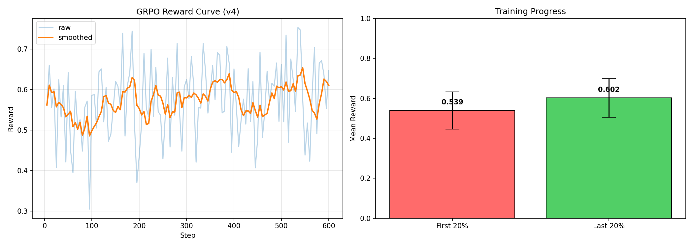

# WorldPolicy-Env V6.1

WorldPolicy-Env is an OpenEnv-compatible geopolitical reinforcement-learning
environment. Seven agents - USA, China, Russia, India, North Korea, Saudi
Arabia, and the United Nations - respond to live crisis scenarios, debate policy
options, vote, and update a shared world state.

The point is legibility. Instead of hiding policy behavior behind opaque action
vectors, the environment exposes what each agent said, how it voted, and how the
decision changed stability, welfare, markets, and diplomatic relationships.

[Live Space](https://huggingface.co/spaces/krishpotanwar/worldpolicy-v6) |
[GitHub](https://github.com/Krishpotanwar/WorldPolicy-Env) |
[Adapter model](https://huggingface.co/krishpotanwar/worldpolicy-grpo-3b) |
[Merged model](https://huggingface.co/krishpotanwar/worldpolicy-grpo-3b-merged)

## What To Try

Open the Space, choose a crisis type, and start a live debate. The strongest
demo path is:

1. Run a natural disaster debate to see humanitarian coordination.
2. Run an arms race debate to see escalation pressure and coalition behavior.
3. Watch the vote outcome and P&L strips update after each debate.
4. Compare the country portraits, sentiment chips, and transcript with the final
   resolution result.

The app is currently configured to use a reliable live LLM backend for the demo.
The trained WorldPolicy checkpoint is preserved as an experimental artifact, but
the most recent qualitative evaluation showed repetition collapse during served
debate generation, so it should not be treated as the final live debate model
until the training recipe is repaired.

## System Overview

WorldPolicy-Env combines four pieces:

- **OpenEnv server**: `environment.py`, `client.py`, and `openenv.yaml` expose
  reset, step, state, schema, and health endpoints.
- **Geopolitical simulator**: `graders.py`, `tasks.py`, `models.py`, and
  `persona_loader.py` maintain crisis state, country relationships, and reward
  scoring.
- **Live data layer**: `live_data.py` and `market_data.py` pull headlines,
  public tone, country economics, and market data with cached fallbacks.
- **Debate UI**: React/Babel frontend files render the globe, country cards,
  transcript, vote bar, and P&L changes inside the Hugging Face Space.

The demo is intentionally small: seven agents, a few crisis families, and clear
state changes. That makes it easier to inspect what happened after each action.

## Live Data

The environment can use live data when network calls succeed and falls back to
stable seeds when they do not.

| Layer | Source | Used for |
|---|---|---|
| Crisis headlines | GDELT v2 | Current crisis description |
| Public sentiment | GDELT tone chart | Agent sentiment chips and prompts |
| Country economics | World Bank API | Country P&L baselines |
| Markets | yfinance | Company and index strips |

The app should not crash when an upstream data source is unavailable. The
fallback path is part of the product, not a separate demo mode.

## Reward Model

The environment reward is a multi-objective geopolitical stability score:

```text
R_final = R_immediate + gamma * V(s_next) + lambda * A_counterfactual + beta * R_robust
```

It combines:

- security stability
- diplomatic relationship movement
- coalition formation
- economic impact
- humanitarian impact
- hard penalties for catastrophic escalation or illegal aggression

The reward is crisis-adaptive. For example, `natural_disaster` weighs
humanitarian outcomes more heavily, while `arms_race` weighs security stability
more heavily.

## Latest Training Run

The latest completed training run used the speech-generation notebook/script
path:

- Base model: `unsloth/Llama-3.2-3B-Instruct`
- Method: SFT warm-up + GRPO
- Job: `krishpotanwar/69f756149d85bec4d76f149d`
- SFT samples: 552
- SFT steps: 400
- GRPO steps: 600
- Rollouts per step: 4
- Adapter repo: `krishpotanwar/worldpolicy-grpo-3b`
- Merged repo: `krishpotanwar/worldpolicy-grpo-3b-merged`

Reward logs from the run:

| Metric | Value |
|---|---:|
| First logged reward | 0.5621 |
| Final logged reward | 0.6471 |
| Max logged reward | 0.7533 |
| First 20% mean | 0.539 |
| Last 20% mean | 0.602 |
| Mean improvement | +0.063 |
| Runtime | 5,094 seconds |
| Train steps/sec | 0.118 |



Important caveat: the scalar reward curve did not catch a generation-quality
failure. The post-training qualitative evaluation generated repeated text and
scored `0.000` on held-out debate prompts. The checkpoint is useful for
debugging the training pipeline, but it is not yet the model to showcase in live
debate. The next training pass should add a stronger anti-collapse reward,
validate held-out generations before upload, and abort automatically if eval
outputs repeat.

## Model Repositories

The training pipeline produces two model artifacts:

- `krishpotanwar/worldpolicy-grpo-3b`: LoRA adapter plus training logs.
- `krishpotanwar/worldpolicy-grpo-3b-merged`: merged standalone model for
  endpoint serving.

The merged model has been tested through the dedicated endpoint, but the current
checkpoint still needs another training pass before it should drive the public
demo.

## Running Locally

```bash
git clone git@github.com:Krishpotanwar/WorldPolicy-Env.git
cd WorldPolicy-Env
python -m venv .venv
source .venv/bin/activate
pip install -r requirements.txt
python server.py
```

Then open:

```text
http://127.0.0.1:7860
```

Docker is also supported:

```bash
docker build -t worldpolicy-env .
docker run --rm -p 7860:7860 --env-file .env worldpolicy-env
```

## Environment Variables

Create a local `.env` from `.env.example` when you want live LLM inference.

| Variable | Required | Purpose |
|---|---|---|
| `HF_TOKEN` | Optional | Hugging Face model and endpoint access |
| `API_BASE_URL` | Optional | OpenAI-compatible endpoint base URL |
| `MODEL_NAME` | Optional | Primary model for inference |
| `MODEL_NAME_FALLBACK` | Optional | Fallback model name |
| `GROQ_API_KEY` | Optional | Groq live debate backend |
| `WP_DEBATE_BACKEND` | Optional | `groq`, `mappo`, or `auto` |

Do not commit real tokens. `.env.example` should contain names and placeholders
only.

## Training

The active training script is:

```bash
hf jobs uv run \
  --flavor a10g-large \
  --timeout 24h \
  --secrets HF_TOKEN \
  --env SFT_STEPS=400 \
  --env GRPO_STEPS=600 \
  --env BATCH_SIZE=2 \
  --env GRAD_ACCUM=4 \
  --env NUM_GENERATIONS=4 \
  -d \
  scripts/train_worldpolicy_v3_hf_job.py
```

After a successful run, merge the LoRA adapter into a standalone model:

```bash
hf jobs uv run \
  --flavor a10g-large \
  --timeout 4h \
  --secrets HF_TOKEN \
  --env ADAPTER_REPO=krishpotanwar/worldpolicy-grpo-3b \
  --env MERGED_REPO=krishpotanwar/worldpolicy-grpo-3b-merged \
  -d \
  scripts/merge_worldpolicy_v3_hf_job.py
```

Before promoting a checkpoint, inspect generated text from held-out prompts. Do
not rely only on the scalar reward curve.

## Repository Map

| Path | Purpose |
|---|---|
| `server.py` | FastAPI app and static Space server |
| `environment.py` | OpenEnv environment implementation |
| `graders.py` | Multi-objective reward and scenario scoring |
| `debate_orchestrator.py` | Live debate backend routing and fallback logic |
| `persona_loader.py` | Agent persona and authority prompt assembly |
| `live_data.py` | GDELT crisis and sentiment fetchers |
| `market_data.py` | yfinance and country market data |
| `train_v3.ipynb` | Current notebook reference for speech-model training |
| `scripts/train_worldpolicy_v3_hf_job.py` | HF Jobs training script |
| `scripts/merge_worldpolicy_v3_hf_job.py` | LoRA-to-merged-model job |
| `training_results/` | Latest reward curve and raw training logs |

## License

Apache-2.0. See [LICENSE](LICENSE).
